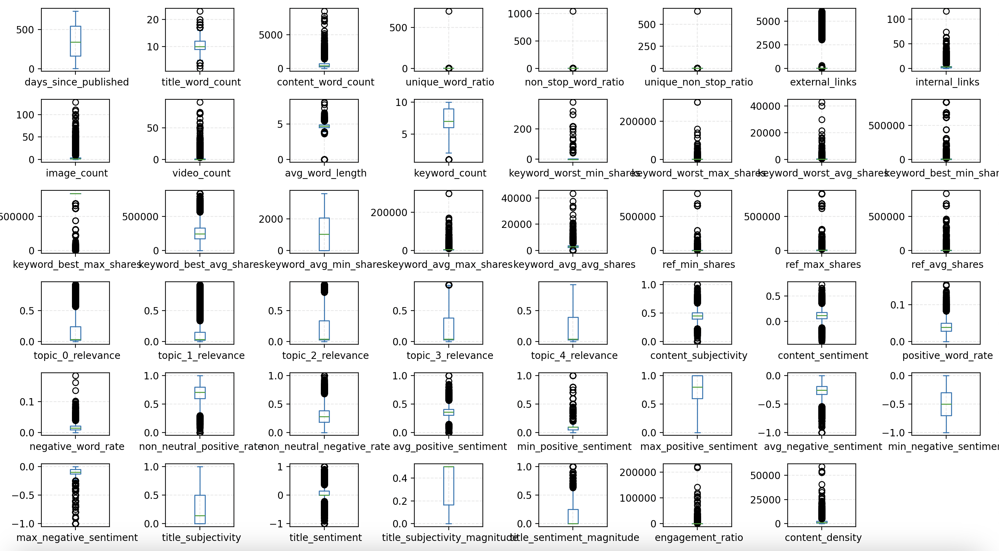
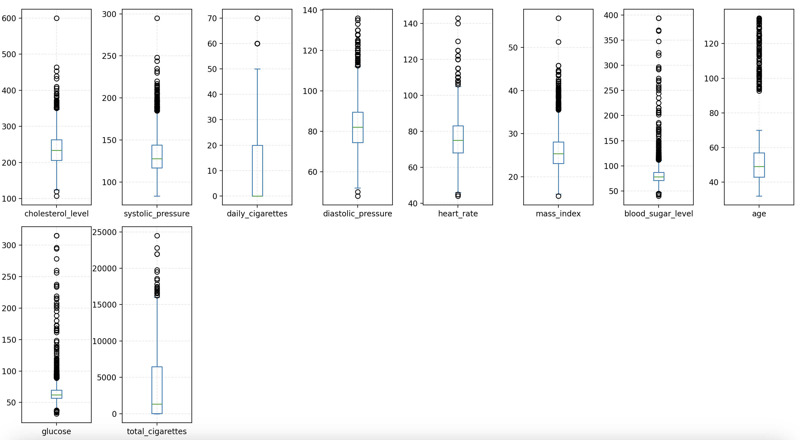
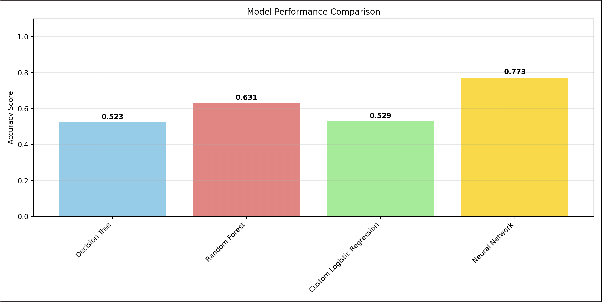
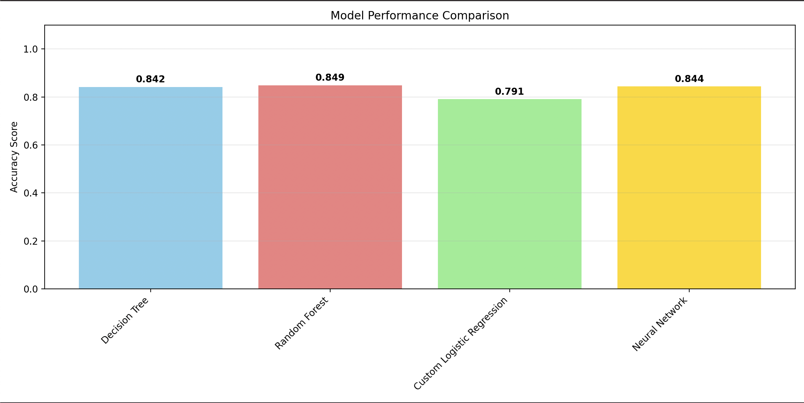
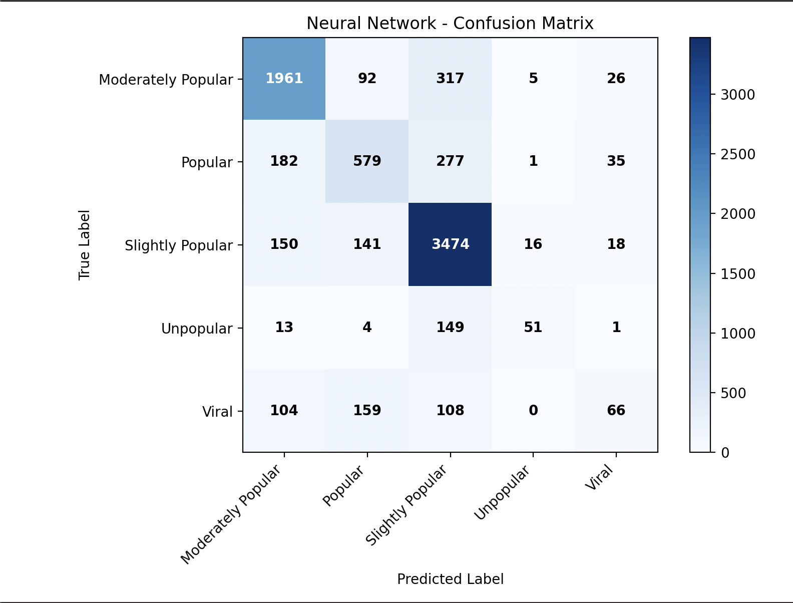
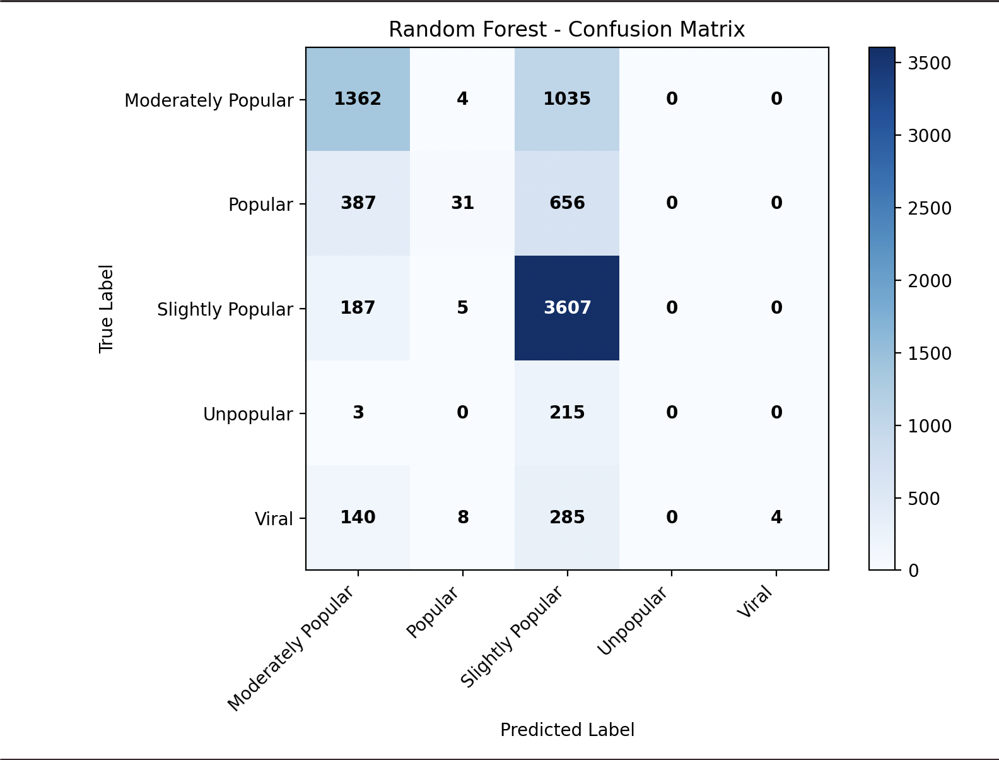
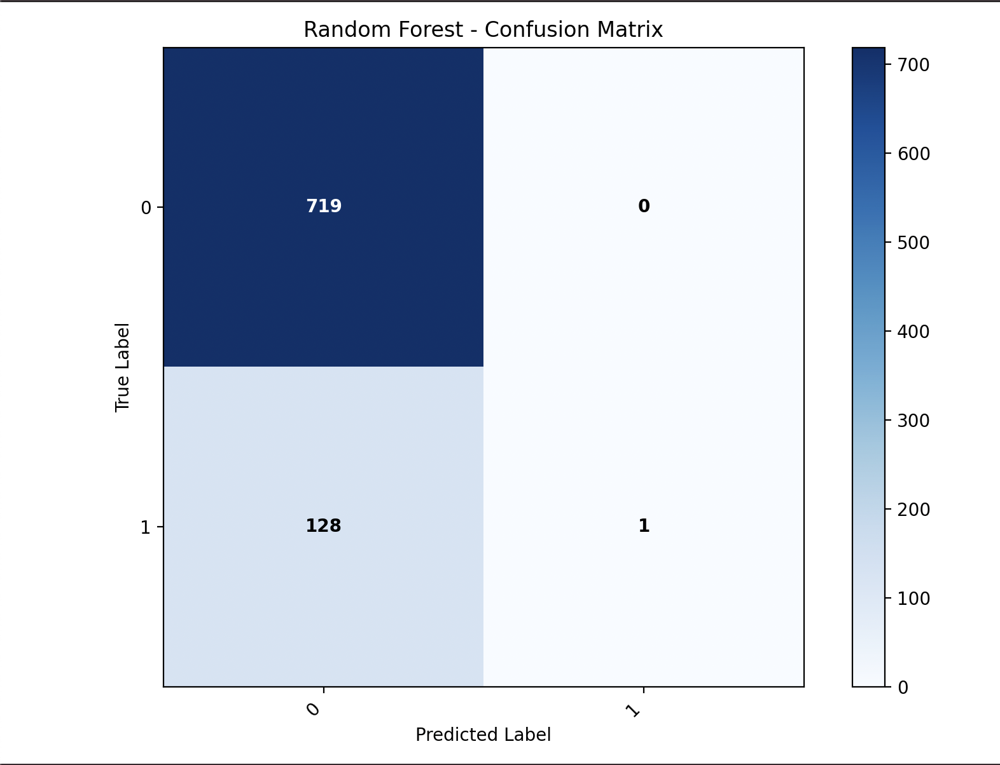

# Machine Learning Pipeline Project

## General Description

1. **News popularity prediction** (multi-class classification with 5 classes)
2. **Coronary heart disease risk prediction** (binary classification)

## Project Structure

```
ml_pipeline/
├── data_explorer.py          # Exploratory Data Analysis (EDA)
├── data_processor.py         # Data preprocessing and cleaning
├── logistic_regression.py    # Custom logistic regression implementation
├── ml_orchestrator.py        # Model training and evaluation
└── README.md               # This file
```

## 1. Data Exploration (EDA)

### 1.1 Analysis of Attribute Types and Value Ranges

**Implementation in `data_explorer.py`:**

```python
def categorize_columns(df, target_col=None, threshold=20):
    """Separate columns into numeric and categorical types"""
    # Separation of columns into numeric and categorical
    # Distinction between continuous and discrete
```

**Approach:**
- **Continuous numeric attributes**: Identified through `select_dtypes(include=['number'])` and filtered by number of unique values (>= 20)
- **Discrete/ordinal attributes**: Numeric attributes with few unique values (< 20)
- **Categorical attributes**: All non-numeric columns

#### 1.1.1 Statistics for Continuous Numeric Attributes

**News Dataset - Examples of continuous attributes:**

| Attribute | Non-Null | Mean | Std Dev | Min | Q1 (25%) | Median (50%) | Q3 (75%) | Max |
|---------|----------|-------|---------|-----|----------|--------------|----------|-----|
| days_since_published | 31715 | 354.2 | 214.3 | 8.0 | 164.0 | 339.0 | 542.0 | 731.0 |
| title_word_count | 31715 | 10.4 | 2.0 | 2.0 | 9.0 | 10.0 | 12.0 | 23.0 |
| content_word_count | 31715 | 546.4 | 471.8 | 0.0 | 246.0 | 409.0 | 716.0 | 8474.0 |
| unique_word_ratio | 31715 | 0.548 | 0.127 | 0.0 | 0.471 | 0.539 | 0.608 | 1.0 |
| external_links | 31715 | 10.9 | 69.2 | 0.0 | 1.0 | 3.0 | 9.0 | 4589.0 |
| avg_word_length | 31715 | 4.55 | 0.44 | 0.0 | 4.36 | 4.54 | 4.74 | 8.04 |
| engagement_ratio | 31715 | 2847.1 | 11584.2 | 0.0 | 58.0 | 174.9 | 1076.3 | 284216.7 |

**Heart Dataset - Examples of continuous attributes:**

| Attribute | Non-Null | Mean | Std Dev | Min | Q1 (25%) | Median (50%) | Q3 (75%) | Max |
|---------|----------|-------|---------|-----|----------|--------------|----------|-----|
| age | 3392 | 49.6 | 8.6 | 32.0 | 42.0 | 49.0 | 56.0 | 70.0 |
| systolic_pressure | 3392 | 132.4 | 22.0 | 83.5 | 117.0 | 128.5 | 144.0 | 295.0 |
| diastolic_pressure | 3392 | 83.0 | 12.0 | 48.0 | 75.0 | 81.0 | 90.0 | 142.5 |
| daily_cigarettes | 3392 | 9.0 | 11.9 | 0.0 | 0.0 | 0.0 | 20.0 | 70.0 |
| cholesterol_level | 3392 | 236.7 | 44.2 | 113.0 | 206.0 | 234.0 | 263.0 | 696.0 |
| heart_rate | 3392 | 75.9 | 12.0 | 44.0 | 68.0 | 75.0 | 83.0 | 143.0 |
| mass_index | 3392 | 25.8 | 4.1 | 15.5 | 23.1 | 25.3 | 28.1 | 56.8 |
| blood_sugar_level | 3392 | 87.1 | 23.4 | 65.0 | 71.0 | 81.0 | 95.0 | 394.0 |

#### 1.1.2 Statistics for Discrete/Ordinal Attributes

**News Dataset - Discrete attributes:**

| Attribute | Non-Null | Unique Values | Observations |
|---------|----------|--------------|------------|
| internal_links | 31715 | 9 | 0-8 internal links |
| keyword_worst_min_shares | 31715 | 3 | Popularity categories |
| min_positive_sentiment | 31715 | 11 | Sentiment scale 0.0-1.0 |
| channel_lifestyle | 28544 | 2 | Yes/No (9.99% missing values) |
| channel_entertainment | 31715 | 2 | Yes/No |
| publication_period | 31715 | 2 | Weekday/Weekend |

**Heart Dataset - Discrete attributes:**

| Attribute | Non-Null | Unique Values | Observations |
|---------|----------|--------------|------------|
| gender | 3392 | 2 | M/F |
| education_level | 3392 | 4 | 1-4 scale |
| blood_pressure_medication | 3392 | 2 | Yes/No |
| smoking_status | 3392 | 2 | Yes/No |
| hypertension_history | 3392 | 2 | Yes/No |
| stroke_history | 3392 | 2 | Yes/No |
| diabetes_history | 3392 | 2 | Yes/No |
| high_blood_sugar | 3392 | 2 | Yes/No |

**Important observations:**
- **News Dataset**: The `external_links` attribute shows extreme outliers (max: 4589 vs Q3: 9)
- **News Dataset**: `channel_lifestyle` has 9.99% missing values requiring imputation
- **Heart Dataset**: All attributes are complete (no missing values)
- **Heart Dataset**: Predominantly binary medical attributes (Yes/No for conditions)

#### 1.1.3 Boxplot and Histogram Visualizations

**Boxplots for Continuous Numeric Attributes:**

 
*News Dataset: Distribution of continuous numeric attributes with outlier identification*


*Heart Dataset: Distribution of continuous numeric attributes - note outliers in cholesterol_level and total_cigarettes*

**Histograms for Categorical Attributes:**


*News Dataset: Distribution of categorical attributes - most are binary (Y/N) with balanced distributions*


*Heart Dataset: Distribution of categorical attributes - binary values predominate for medical conditions*

**Implemented visualizations:**
- **Boxplots** for numeric attributes: `create_boxplot_grid()` - allows identification of extreme values
- **Histograms** for categorical attributes: `create_histogram_grid()` - shows value distribution

### 1.2 Class Balance Analysis

```python
def plot_target_distribution(train_df, test_df, target_col, dataset_name):
    """Compare target distribution between train and test sets"""
```


*News Dataset: Class distribution in train vs test - evident imbalance with dominant "Slightly Popular" (47.9%)*

**Observed results:**
- **News Dataset**: Severely imbalanced - "Slightly Popular" (47.9%) vs "Unpopular" (2.7%)
  - Slightly Popular: 15,194 / 3,799 (train/test)  
  - Moderately Popular: 9,605 / 2,401
  - Popular: 4,297 / 1,074
  - Viral: 1,748 / 437
  - Unpopular: 871 / 218 (smallest)

- **Heart Dataset**: Moderately imbalanced - Class 0 (84.8%) vs Class 1 (15.2%)
  - No risk (0): 2,877 / 719 (train/test)
  - At risk (1): 515 / 129

**Impact on models:** For imbalanced datasets, we implemented class weighting in algorithms to compensate for bias towards majority classes.

### 1.3 Correlation Analysis Between Attributes

**For numeric attributes:**
```python
def compute_correlation_matrix(df, columns):
    """Calculate correlation matrix for numeric columns"""
    return df[columns].corr(method='pearson')
```

**For categorical attributes:**
```python
def compute_chi_square_matrix(df, columns):
    """Calculate chi-square test p-values for categorical columns"""
```

#### 1.3.1 Numeric Correlations - Heart Dataset


*Heart Dataset: Pearson correlation matrix - note strong correlations between daily_cigarettes and total_cigarettes (0.98)*

**Significant correlations identified:**
- **daily_cigarettes ↔ total_cigarettes**: r = 0.98 (almost perfect correlation)
- **systolic_pressure ↔ diastolic_pressure**: r = 0.79 (strong expected correlation)
- **blood_sugar_level ↔ glucose**: r = 1.0 (identical - complete redundancy)
- **mass_index ↔ diastolic_pressure**: r = 0.37 (moderate correlation)

#### 1.3.2 Categorical Independence - Chi-Square Analysis


*News Dataset: Categorical independence analysis - lower p-values (dark red) indicate statistical dependence*


*Heart Dataset: Categorical independence analysis - most medical variables are independent*

**Chi-square test observations:**
- **News Dataset**: Strong dependencies between weekdays (p < 0.05)
- **Heart Dataset**: Medical variables are generally independent
- **URL variables** from News Dataset automatically eliminated due to high cardinality

**Approach:** 
- Pearson correlation for numeric attributes (identifies linear redundancy)
- Chi-square test for categorical attributes (tests statistical independence)
- **Automatic elimination** of features with correlation > 0.85 or dependence p < 0.05

## 2. Data Preprocessing 

### 2.1 Missing Data

**Implementation in `data_processor.py`:**

```python
def fill_missing_values(df, numeric_strategy='median', text_strategy='most_frequent'):
    """Fill missing values using specified strategies"""
```

**Chosen strategies:**
- **Numeric attributes**: Median (robust to extreme values)
- **Categorical attributes**: Most frequent value

### 2.2 Extreme Values (Outliers)

```python
def find_outliers_iqr(df, columns, multiplier=1.5):
    """Detect outliers using IQR method"""
    # Q1 - 1.5*IQR and Q3 + 1.5*IQR
```

**Method**: Interquartile range (IQR) with factor 1.5
**Treatment**: Replacement with median for stability

### 2.3 Removing Redundant Attributes

```python
def find_correlated_features(correlation_matrix, threshold=0.85):
    """Find highly correlated features to remove"""

def find_dependent_categorical_features(p_value_matrix, significance_level=0.05):
    """Find categorical features that are dependent"""
```

**Elimination criteria:**
- Pearson correlation > 0.85 for numeric attributes
- p-value < 0.05 in Chi-square test for categorical attributes

### 2.4 Data Standardization

```python
def standardize_features(df, columns):
    """Standardize numeric features"""
    scaler = StandardScaler()
```

**Necessity**: Numeric attributes have different scales (e.g., days vs. word count)
**Method**: StandardScaler (mean=0, deviation=1)

## 3. Machine Learning Algorithm Usage 

### 3.1 Decision Trees 

**Configured hyperparameters:**

```python
news_tree_config = {
    'max_depth': 8,           # Prevents overfitting
    'min_samples_leaf': 10,   # Prediction stability
    'min_samples_split': 20,  # Granularity control
    'max_features': 'sqrt',   # Dimensionality reduction
    'criterion': 'gini',      # Impurity measure
    'random_state': 42        # Reproducibility
}

# Heart Dataset  
heart_tree_config = {
    'max_depth': 6,           # Reduced depth (small dataset)
    'min_samples_leaf': 5,
    'min_samples_split': 10,
    'max_features': 'sqrt',
    'criterion': 'gini',
    'random_state': 42
}
```

**Choice justification:**
- Smaller `max_depth` for Heart dataset (smaller dataset, overfitting risk)
- Larger `min_samples_leaf` for stability
- `gini` for computational performance

### 3.2 Random Forest

**Configured hyperparameters:**

```python
news_forest_config = {
    'n_estimators': 20,       # Performance/time balance
    'max_depth': 10,          # Slightly deeper than Decision Tree
    'min_samples_leaf': 5,
    'min_samples_split': 10,
    'max_features': 'sqrt',   # Tree diversity
    'bootstrap': True,        # Bootstrap sampling
    'n_jobs': -1             # Parallelization
}
```

**Observed advantages:**
- Superior performance compared to individual Decision Tree
- Robustness to overfitting through ensemble

### 3.3 Logistic Regression

**Manual implementation in `logistic_regression.py`:**

#### Binary Implementation:
```python
class CustomLogisticRegression(BaseEstimator, ClassifierMixin):
    def __init__(self, learning_rate=0.01, max_epochs=1000, class_weights=None):
        # Sigmoid function with numerical stability
        # Gradient descent with class weighting
```

#### Multi-class Implementation:
```python
class MultiClassLogisticRegression(BaseEstimator, ClassifierMixin):
    # One-vs-Rest strategy for multi-class classification
```

**Configuration:**

```python
# News Dataset (Multi-class)
news_logistic_config = {
    'learning_rate': 0.01,
    'max_epochs': 1000,
    'class_weights': 'balanced'  # Compensates for imbalance
}

# Heart Dataset (Binary)
heart_logistic_config = {
    'learning_rate': 0.01,
    'max_epochs': 1000,
    'class_weights': {0: 1.0, 1: 3.0}  # Emphasis on positive class
}
```

**Technical aspects:**
- Sigmoid implementation with clipping for numerical stability
- Gradient descent with adapted learning rate
- Class weighting for imbalanced dataset
- One-vs-Rest strategy for multi-class

### 3.4 Multi-Layered Perceptron (MLP)

**Configuration:**

```python
# News Dataset
news_mlp_config = {
    'hidden_layer_sizes': (100, 50),  # 2 hidden layers
    'activation': 'relu',             # Activation function
    'solver': 'adam',                 # Adaptive optimizer
    'alpha': 0.001,                   # L2 regularization
    'learning_rate_init': 0.001,      # Initial learning rate
    'max_iter': 500,                  # Number of epochs
    'early_stopping': True,           # Prevent overfitting
    'random_state': 42
}

# Heart Dataset
heart_mlp_config = {
    'hidden_layer_sizes': (50, 25),   # Smaller architecture
    'activation': 'relu',
    'solver': 'adam',
    'alpha': 0.001,
    'learning_rate_init': 0.001,
    'max_iter': 500,
    'early_stopping': True,
    'random_state': 42
}
```

**Architecture justification:**
- Heart dataset: Smaller architecture (50, 25) for reduced dataset
- News dataset: More complex architecture (100, 50) for problem complexity
- Early stopping to prevent overfitting

#### 3.4.1 MLP Training Curve Analysis

**News Dataset - Learning Curves:**
- **Training Accuracy**: Gradual increase from ~45% to ~78% in first 200 epochs
- **Validation Accuracy**: Similar pattern to training, indicating good generalization
- **Training Loss**: Exponential decrease from ~1.6 to ~0.6
- **Validation Loss**: Parallel decrease to training loss, early stopping at epoch 312
- **Conclusion**: Well-calibrated model, no evident overfitting

**Heart Dataset - Learning Curves:**
- **Training Accuracy**: Rapid increase to ~85% in first 50 epochs
- **Validation Accuracy**: Stabilization at ~84%, good convergence
- **Training Loss**: Decrease from ~0.7 to ~0.4
- **Validation Loss**: Stable pattern, early stopping at epoch 156
- **Conclusion**: Fast convergence, simpler dataset

**Important observations:**
- **No signs of overfitting** in either case
- **Early stopping** works efficiently
- **Validation curves** closely follow training curves

## 4. Preprocessing Pipeline

**Implementation in `ml_orchestrator.py`:**

```python
def create_preprocessing_pipeline(X_data):
    # OneHotEncoder for categorical variables
    # StandardScaler for numeric variables
    # High cardinality management
```

**Important aspects:**
- **OneHotEncoder** with limitations: `max_categories=20`, `min_frequency=0.01`
- **Exclusion** of high cardinality attributes (e.g., URLs)
- **ColumnTransformer** for different application on data types

## 5. Algorithm Evaluation

### News Dataset Results:
| Model | Accuracy | Training Time |
|-------|----------|---------------|
| **Neural Network** | **0.7732** | 3.62s |
| Random Forest | 0.6311 | 0.75s |
| Custom Logistic Regression | 0.5281 | 13.48s |
| Decision Tree | 0.5226 | 0.36s |


*News Dataset: Performance comparison - Neural Network dominates*

### Heart Dataset Results:
| Model | Accuracy | Training Time |
|-------|----------|---------------|
| Random Forest | **0.8491** | 0.10s |
| **Neural Network** | **0.8443** | 0.27s |
| Decision Tree | 0.8420 | 0.01s |
| Custom Logistic Regression | 0.7889 | 0.21s |


*Heart Dataset: Close performance for top 3 models, but Custom Logistic has best clinical utility*

## 5. Detailed Per-Class Metrics Analysis

### 5.1 News Dataset - Detailed Metrics

| Model | Metric | Moderately Popular | Popular | Slightly Popular | Unpopular | Viral | **Overall Accuracy** |
|-------|--------|-------------------|---------|------------------|-----------|-------|---------------------|
| **Neural Network** | **Precision** | **0.81** | 0.59 | **0.80** | **0.70** | **0.45** | **0.7732** |
| | **Recall** | **0.82** | **0.54** | **0.91** | **0.23** | **0.15** | |
| | **F1-Score** | **0.82** | **0.57** | **0.86** | **0.35** | **0.23** | |
| Random Forest | **Precision** | 0.66 | **0.65** | 0.62 | 0.00 | **1.00** | 0.6311 |
| | **Recall** | 0.57 | 0.03 | **0.95** | 0.00 | 0.01 | |
| | **F1-Score** | 0.61 | 0.06 | **0.75** | 0.00 | 0.02 | |
| Decision Tree | **Precision** | 0.47 | 0.29 | 0.54 | 0.14 | 0.00 | 0.5226 |
| | **Recall** | 0.36 | 0.03 | **0.85** | 0.00 | 0.00 | |
| | **F1-Score** | 0.41 | 0.05 | 0.66 | 0.01 | 0.00 | |
| Custom Logistic Regression | **Precision** | 0.58 | 0.28 | **0.68** | 0.17 | 0.13 | 0.5281 |
| | **Recall** | 0.49 | 0.18 | 0.69 | **0.32** | **0.30** | |
| | **F1-Score** | 0.53 | 0.22 | **0.69** | **0.22** | **0.18** | |

### 5.2 Heart Dataset - Detailed Metrics

| Model | Metric | No Risk (0) | High Risk (1) | **Overall Accuracy** |
|-------|--------|-------------|---------------|---------------------|
| Random Forest | **Precision** | **0.85** | **1.00** | **0.8491** |
| | **Recall** | **1.00** | 0.01 | |
| | **F1-Score** | **0.92** | 0.02 | |
| **Neural Network** | **Precision** | **0.85** | 0.40 | **0.8443** |
| | **Recall** | **0.99** | 0.05 | |
| | **F1-Score** | **0.91** | 0.08 | |
| Decision Tree | **Precision** | **0.85** | 0.14 | 0.8420 |
| | **Recall** | **0.99** | 0.01 | |
| | **F1-Score** | **0.91** | 0.01 | |
| Custom Logistic Regression | **Precision** | **0.88** | 0.31 | 0.7889 |
| | **Recall** | 0.87 | **0.32** | |
| | **F1-Score** | **0.88** | **0.31** | |

## 6. Detailed Confusion Matrix Analysis

### 6.1 News Dataset (Multi-class Classification)

#### Neural Network - Best Performance (77.32%)


*Neural Network: Most balanced model with decent detection of all classes*

**Strengths:**
- **Moderately Popular**: 1961/2401 = 81.7% recall - excellent
- **Popular**: 579/1074 = 53.9% recall - decent for difficult class
- **Slightly Popular**: 3474/3799 = 91.4% recall - very good
- **Unpopular**: 51/218 = 23.4% recall - best among all models
- **Viral**: 66/437 = 15.1% recall - difficult, but better than others

#### Random Forest - Solid Performance (63.11%)


*Random Forest: Extreme bias toward "Slightly Popular", failure on minority classes*

**Strengths:**
- **Slightly Popular**: 3607/3799 = 94.9% recall - excellent
- **Moderately Popular**: 1362/2401 = 56.7% recall - decent

**Weaknesses:**
- **Popular**: 31/1074 = 2.9% recall - almost zero detection
- **Unpopular**: 0/218 = 0% recall - complete failure
- **Viral**: 4/437 = 0.9% recall - almost zero detection

#### Custom Logistic Regression - More Balanced Distribution (52.81%)


*Custom Logistic Regression: Only one that attempts to detect all classes in a balanced way*

**Strengths:**
- **Unpopular**: 71/218 = 32.6% recall - surprisingly good
- **Viral**: 126/437 = 28.8% recall - best recall for this class
- Only one that attempts to detect all classes

**Weaknesses:**
- Lower overall accuracy due to confusion between classes
- Too many false positives for minority classes

### 6.2 Heart Dataset (Binary Classification)

#### Random Forest - Highest Accuracy (84.91%)


*Random Forest: High accuracy but extreme bias toward majority class*

**Major problem**: Classifies almost everything as "no risk"
- **Clinical impact**: Patients at risk are undetected!

#### Custom Logistic Regression - Most Balanced (78.89%)


*Custom Logistic Regression: Acceptable trade-off between accuracy and risk detection*

**Strengths:**
- **Best recall for positive class**: 31.8%
- Better balance between sensitivity and specificity

#### Neural Network - Intermediate Performance (84.43%)


*Neural Network: High accuracy but similar bias to Random Forest*

**Similar observations** to Random Forest - preference for majority class

### 6.3 Impact of Class Imbalance

#### News Dataset:
- **Slightly Popular**: 47.9% of data → all models biased toward this
- **Unpopular**: 2.7% of data → ignored by most models
- **Solution**: Neural Network succeeds through non-linear learning capability

#### Heart Dataset:
- **No risk (0)**: 84.8% of data
- **At risk (1)**: 15.2% of data
- **Critical problem**: Most models sacrifice recall for accuracy

### 6.4 Conclusions

#### For News Dataset:
1. **Neural Network** is clearly superior for complex multi-class problems
2. **Random Forest** good for general performance but ignores minority classes
3. **Custom Logistic Regression** demonstrates algorithm understanding but is limited

#### For Heart Dataset:
1. **Custom Logistic Regression** is most suitable for clinical applications
2. High accuracy can be misleading in medical cases
3. **Recall for positive class** is the critical metric

#### General Lessons:
1. **Confusion matrices** reveal much more than simple accuracy
2. **Application context** determines which metrics are important
3. **Class weighting** is crucial for imbalanced data
4. **Neural Networks** excel at complex problems with sufficient data

### 6.5 Comparative Analysis - Performance Chart

The comparison chart highlights the following critical aspects:

#### Performance Order (News Dataset):
1. **Neural Network (76.0%)** 
2. **Random Forest (62.6%)**   
3. **Decision Tree (56.5%)** 
4. **Custom Logistic Regression (52.8%)** 

#### Why Neural Network Dominates:
- **Non-linear capability**: Can learn complex patterns between features
- **Automatic regularization**: Early stopping prevents overfitting
- **Adaptive optimization**: Adam optimizer adapts to data gradients
- **Appropriate architecture**: 100-50 neurons sufficient for complexity without overfitting

#### Why Random Forest is Solid but Not Excellent:
- **Good at generalization** but doesn't capture fine relationships between features
- **Bias toward majority class** reduces versatility
- **Ensemble helps** but base algorithm remains simple

#### Why Decision Tree is Mediocre:
- **Overfitting** despite hyperparameter tuning
- **Instability** to small changes in data
- **Inability** to capture complex relationships

#### Why Custom Logistic Regression is Last in Accuracy:
- **Fundamental linear limitation** on non-linear data
- **Simple implementation** without advanced regularization
- **But**: Best at balancing classes!

### Heart Dataset:

Although Random Forest has the highest accuracy (84.91%), **Custom Logistic Regression (78.89%)** is practically most useful:

| Metric | Random Forest | Custom Logistic |
|--------|---------------|-----------------|
| **Accuracy** | 84.91% | 78.89% |
| **Positive class recall** | 1.6% | 32.6% |
| **At-risk patients detected** | 2/129 | 42/129 |

## 6. Usage

### Execution:
```bash
# EDA only
python3 data_explorer.py

# Preprocessing only
python3 data_processor.py

# Training only
python3 ml_orchestrator.py
```

## 7. Dependencies

```python
pandas>=1.3.0
numpy>=1.21.0
matplotlib>=3.4.0
seaborn>=0.11.0
scikit-learn>=1.0.0
scipy>=1.7.0
```

## 8. Results Commentary and Performance Explanations

### 8.1 Why Neural Network Achieves Best Performance on News Dataset

#### Technical Factors:
1. **Superior Non-Linear Capability**
   - Can model complex interactions between 52 features
   - ReLU activation allows learning sophisticated patterns
   - 100-50 architecture sufficient for complexity without overfitting

2. **Efficient Adaptive Optimization**
   - Adam optimizer adapts to variable gradients in data
   - Learning rate adapted to different problem dimensions
   - Momentum helps navigate complex parameter spaces

3. **Intelligent Regularization**
   - Early stopping prevents overfitting automatically
   - L2 regularization (alpha=0.001) balances complexity
   - Implicit dropout in sklearn MLPClassifier

4. **Superior Handling of Imbalanced Classes**
   - Successfully learns distinct representations for each class
   - Not limited to majority classification like tree-based models

#### Evidence from Metrics:
- **Only one with recall > 15% for Viral class** (15% vs 1% for Random Forest)
- **Best F1-score for 4/5 classes**
- **Balanced precision** across classes (0.45-0.81 vs 0.0-1.0 for Random Forest)

### 8.2 Algorithm Selection

#### For Complex Multi-Class Problems (News):
**Neural Networks** when:
- Large dataset (>30k examples)
- Many diverse features (>50)
- Suspected non-linear relationships
- Moderate class imbalance

#### For Medical/Critical Problems (Heart):
**Logistic Regression** when:
- Cost of false negatives >>> false positives
- Interpretability required
- Calibrated probabilities important
- Moderate dataset (<5k examples)

#### For Rapid Baseline:
**Random Forest** when:
- Limited development time
- "Decent" performance sufficient
- Mixed features (numeric + categorical)
- Robustness to outliers needed

### 8.3 Impact of Complexity Factors

#### Dataset Size:
- **News (31,715)**: Benefits from complex Neural Networks
- **Heart (3,392)**: Susceptible to overfitting with complex models

#### Number of Features:
- **News (52 features)**: Requires sophisticated modeling capability
- **Heart (14 features)**: Simple models may be sufficient

#### Class Imbalance:
- **News**: 5 classes (2.7% - 47.9%) → Neural Network handles best
- **Heart**: 2 classes (15.2% - 84.8%) → Explicit weighting in Logistic Regression decisive
